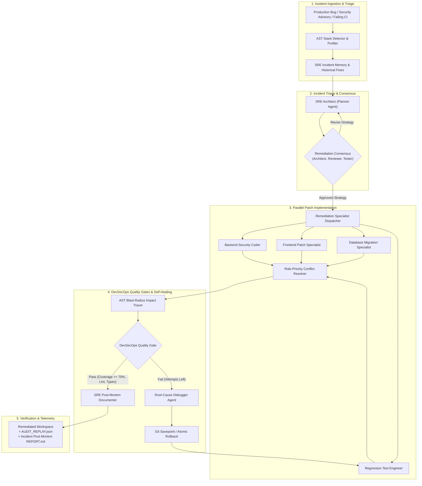

# PatchGuard AI: Autonomous DevSecOps & Self-Healing SRE Remediation Engine

[](https://www.python.org)
[](https://www.crewai.com)
[](https://streamlit.io)
[](LICENSE)

**PatchGuard AI** is an autonomous DevSecOps and Site Reliability Engineering (SRE) engine designed to triage software regressions, diagnose root causes, generate verified security and bug patches, and automatically heal broken builds.

Powered by a native **CrewAI** multi-agent pipeline and Abstract Syntax Tree (AST) static code intelligence, PatchGuard AI guarantees that every remediation patch satisfies rigorous quality gates including regression blast-radius analysis, static type integrity, security vulnerability scanning, and branch coverage thresholds with atomic Git rollbacks on failure.

---

## 🏗️ DevSecOps Remediation Architecture



---

## ⚡ Core DevSecOps & SRE Capabilities

### 1. AST Dependency Mapping & Regression Blast-Radius Isolation
When applying security patches or bug fixes, naive automation often introduces hidden regression failures. PatchGuard AI parses workspace files into Python Abstract Syntax Trees (`ast`), constructing a complete caller-callee dependency graph (`build_call_graph`). Before and after each patch, PatchGuard computes the **blast radius** (`analyze_change_impact`), identifying every downstream function and service impacted by modified symbols so automated regression tests can target vulnerable call sites.

### 2. Multi-Role CrewAI Remediation Specialists
Remediation workloads are fanned out concurrently across specialized CrewAI agent personas:
- **SRE Architect (Planner)**: Evaluates incident context, detects frameworks, and authors structured remediation plans.
- **Security & Coder Specialists (Backend, Frontend, DB)**: Synthesize targeted patches in parallel.
- **Code Reviewer**: Audits proposed diffs for architectural integrity and anti-patterns.
- **Regression Test Engineer**: Generates comprehensive unit, integration, and edge-case regression tests.
- **Root-Cause Debugger**: Parses error tracebacks, attributes failures to blamed source files, and iteratively applies fixes.

### 3. Closed-Loop Self-Healing with Atomic Git Rollback
Every remediation run operates inside a sandboxed environment with strict safety guarantees:
- **Git Savepoints**: Automatic snapshot commits (`git_savepoint`) before applying modifications.
- **Atomic Rollback**: If a debug loop exhausts its attempt budget without satisfying quality gates, PatchGuard automatically executes `git_rollback()` to revert the repository to the last known green state, preventing corrupt code deployments.

### 4. Multi-Stage DevSecOps Quality Gates
A patch is never accepted based on LLM confidence alone. The engine enforces:
- **Automated Regression Suite**: Unit and integration test pass verification (`pytest`).
- **Branch Coverage Threshold**: Minimum 70% branch coverage required (`pytest-cov`).
- **Static Analysis & Linting**: Ruff AST linter verification.
- **Type Checking**: Ty static type integrity validation.
- **Security & Mutation Probing**: AST mutation checks and dependency auditing.

### 5. Runtime Token Economics & Budget Guardrails
Prevents runaway model inference costs with configurable policy thresholds (`max_tokens`, `max_cost_usd`). Computes real-time token expenditure across OpenAI, Google Gemini, and local Ollama models, raising `BudgetExceededError` if safety budgets are breached.

### 6. Regulatory Audit Trails & Machine-Readable Replays
Captures all remediation decisions, execution latencies, AST impact traces, and git hashes into an exportable `AUDIT_REPLAY.json` document for enterprise compliance and SRE post-mortems.

---

## 📂 Project Structure

```text
├── src/patchguard/            # Core DevSecOps engine package
│   ├── autonomy.py            # Remediation cycle budgeting & autonomous loops
│   ├── codeintel.py           # AST call graphs, blast-radius tracer & traceback attribution
│   ├── collab.py              # Parallel specialist dispatch, consensus voting & conflict merge
│   ├── crew.py                # CrewAI agent personas, tools & token cost tracking
│   ├── graph.py               # Native CrewAI pipeline execution flow & state routers
│   ├── llm.py                 # Multi-provider LLM bindings (Ollama, OpenAI, Gemini)
│   ├── policy.py              # Security sandbox, path traversal guards & budget limits
│   ├── quality.py             # DevSecOps quality gates: coverage, ruff, ty, security & perf
│   ├── reliability.py         # Exponential backoff retries, circuit breakers & fallbacks
│   ├── settings.py            # Global configuration & environment constants
│   ├── shell.py               # Command allowlisting & sandboxed subprocess execution
│   ├── stack.py               # Technology stack detection & idiom discovery
│   ├── templates.py           # Scaffolding templates & database schema overlays
│   ├── tools.py               # Tool adapters exposed to CrewAI agent personas
│   └── workspace.py           # Git versioning, savepoints, rollback & audit replays
├── tests/                     # 100+ comprehensive unit and regression tests
├── streamlit_app.py           # Real-time incident remediation dashboard & operator UI
├── RESUME_GUIDE.md            # Resume bullets, elevator pitch & interview Q&A
├── pyproject.toml             # Package definition, dependencies & strict linters
└── run.cmd / run.sh           # One-click startup scripts
```

---

## 🚀 Quickstart

### Prerequisites
- Python 3.12+
- [uv](https://docs.astral.sh/uv/) package manager
- Optional: [Ollama](https://ollama.com/) for zero-cost, fully private offline execution

### 1. Installation
```bash
# Clone the repository
git clone https://github.com/kishan-pithadiya/patchguard-ai
cd patchguard-ai

# Synchronize dependencies with uv
uv sync --all-groups

# Configure environment
cp .env.example .env
```

### 2. Configure Providers
Edit `.env` to configure your LLM backend:
- **Local (Free & Offline)**: Install Ollama, run `ollama run llama3.2`, leave API keys blank.
- **OpenAI**: Set `OPENAI_API_KEY`.
- **Google Gemini**: Set `GOOGLE_API_KEY`.

### 3. Launching
Run via the packaged console script:
```bash
uv run patchguard
```
Or launch the operator dashboard directly:
```bash
uv run streamlit run streamlit_app.py
```

---

## 🧪 Testing & Verification

PatchGuard AI enforces strict automated testing:

```bash
# Run unit & regression test suite
uv run pytest

# Check code formatting & linting
uv run ruff check .
uv run ruff format --check .

# Static type verification
uv run ty check src/

# Dependency security audit
uv run pip-audit .
```

---
---

## 📄 License

Distributed under the MIT License. See [LICENSE](LICENSE) for details.
